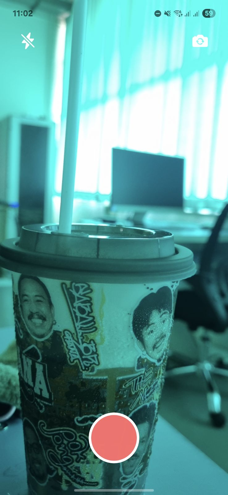
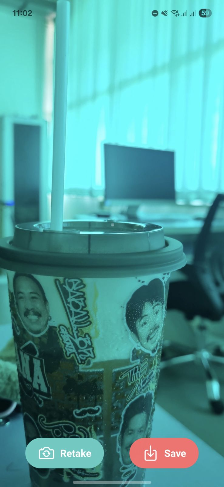

# Camera-App

A simple **camera application** built with **React Native + Expo**  
that lets you open the camera, capture photos, and preview them instantly.

---

## Features

- Toggle between front and back cameras
- Capture photos and display them immediately
- Flash screen + haptic feedback on capture
- Clean and simple UI, works on both Android & iOS

---

## Screenshots

| Camera Screen 1                      | Camera Screen 2                              |
| ------------------------------------ | -------------------------------------------- |
|  |  |

---

## Installation

1. **Clone the repository**

   ```bash
   https://github.com/Onpreeya-Jantakote/Camera-App.git
   cd Camera-App

   ```

2. **Install dependencies**

```bash
    npm install
    # or
    yarn install

```

3. **Start the development server**

```bash
npx expo start

```

**Tech Stack**

- React Native

- Expo

- expo-camera

- expo-haptics